1.	Используйте git status, чтобы узнать, на какой ветке вы находитесь.
main
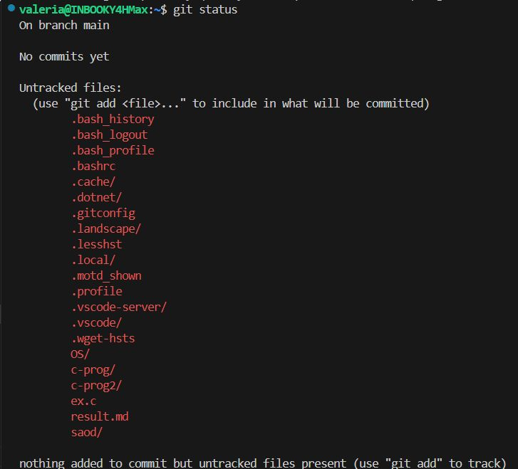  
2.	Как выглядит git log?
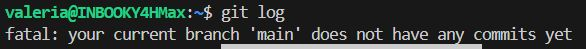 
3.	Создайте файл sort.c и вставьте туда код функции любой сортировки (только ф-ия сортировки)
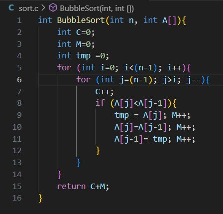 
4.	Как сейчас выглядит вывод git status?
добавился неотслеживаемый файл sort.c
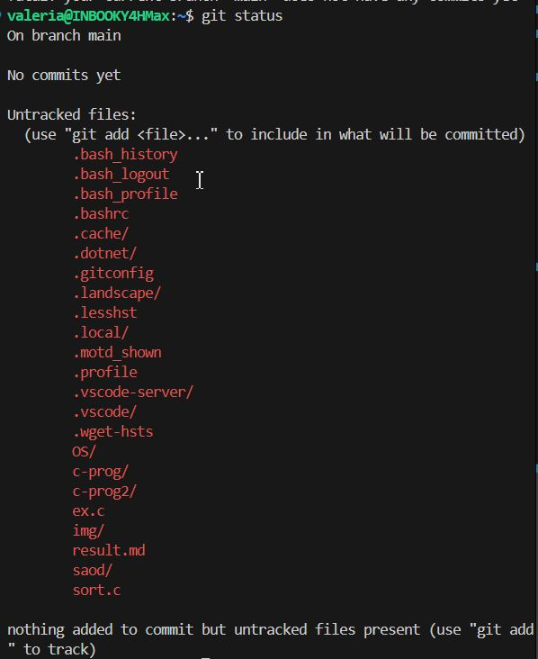 
5.	Добавьте файл в область stage (add)
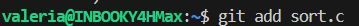   
6.	Как сейчас выглядит git status?
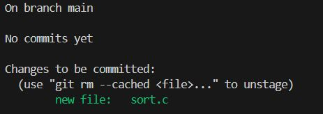   
7.	Закоммитить файл в репозиторий
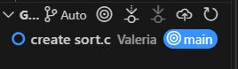  
8.	Как сейчас выглядит git status?
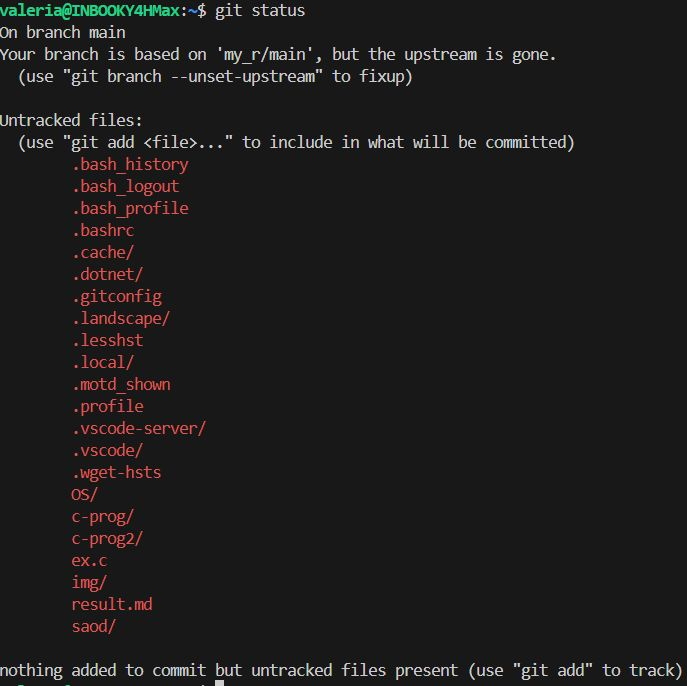
9.	Добавить комментарий с любым текстом в этот же файл
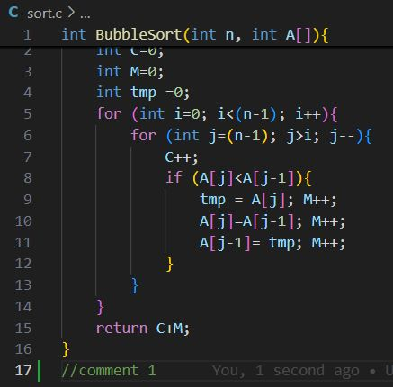
10.	 Как сейчас выглядит git status?
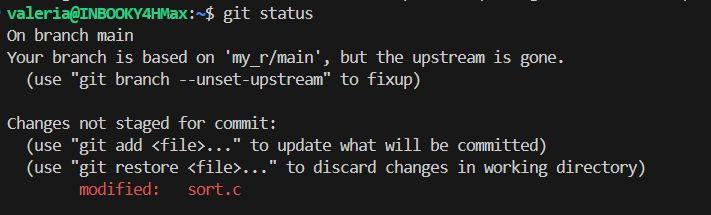
11.	 Добавьте (add) изменение файла
12.	 Как сейчас выглядит git status?
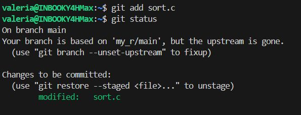
13.	 Измените файл еще раз (можно добавить еще комментарий или убрать старый)
14.	 Сделайте коммит
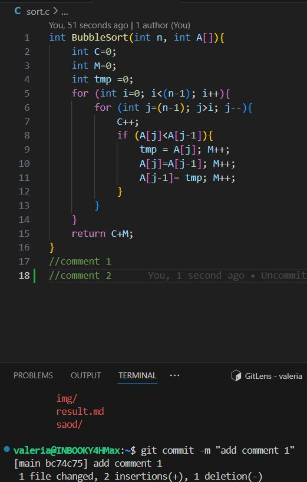
15.	 Как сейчас выглядит status? Журнал (log)?
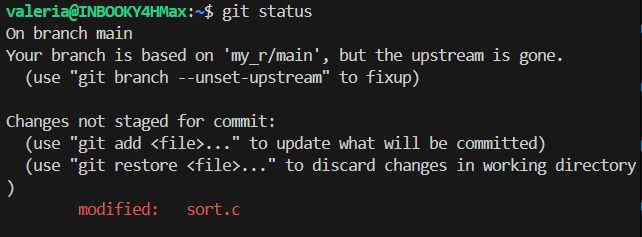
16.	 Добавьте в stage и закоммитьте последнее изменение
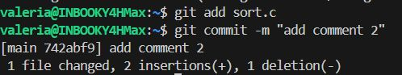
17.	 Запушим на удаленный репо (git push)
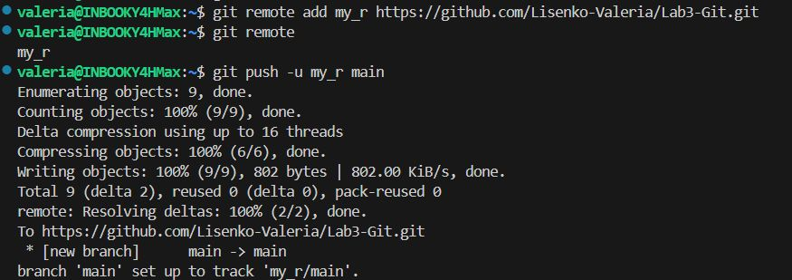
Теперь мы немного поиграем с ветками. 
1.	Используйте git branch mybranch (или git checkout -b mybranch), чтобы создать новую ветку с именем mybranch.
2.	Снова используйте git branch, чтобы увидеть новую созданную ветку.
3.	Используйте git switch mybranch (или git checkout mybranch), чтобы переключиться на новую ветку.
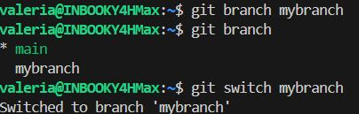
4.	Как изменяется вывод git status при переключении между master и новой веткой, которую вы создали?
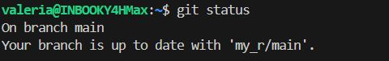
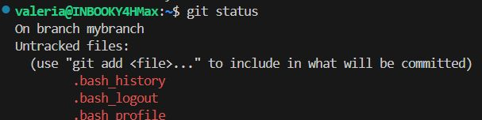
5.	Убедитесь, что вы находитесь на своей ветке mybranch, прежде чем продолжить.
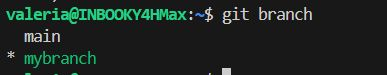
6.	Создайте файл с именем file1.txt и своим именем.
7.	Добавьте файл и закоммитьте это изменение.
8.	Используйте git log --oneline --graph, чтобы увидеть, что ваша ветка указывает на новый коммит.
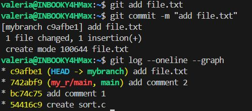
9.	Вернитесь к ветке с именем master.
10.	Используйте git log --oneline --graph, что изменилось?
Пропал новый коммит о добавлении txt файла, изменился указатель HEAD на последний коммит в текущей ветке, так как ветка поменялась 
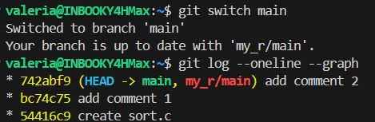
11.	Создайте новый файл с именем file2.txt и закоммитьте его.
12.	Используйте git log --oneline --graph --all, чтобы увидеть, что ваша ветка указывает на новый коммит, и что теперь у двух веток разные коммиты.
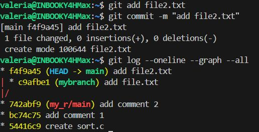
13.	Переключитесь на вашу ветку mybranch.
14.	Наш file2.txt пропал?
да
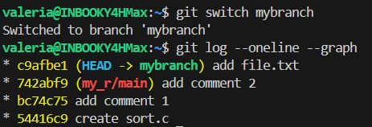
15.	Используйте git diff mybranch master, чтобы увидеть разницу между двумя ветками.
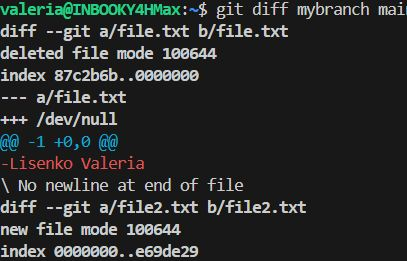
16.	 Добавить текстовый документ со скриншотами в ветку mybranch. Закоммитить и запушить на удаленный репо ветку mybranch (git push -u origin mybranch)

17.	 Убедиться что в github.com две ветки master и mybranch. Не забыть запушить изменения master ветки в master

