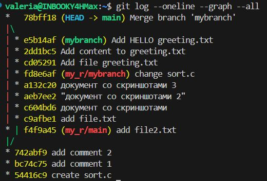

Оценка 4:
1.	Переключитесь на ветку mybranch. В ней будет файл sort.c из предыдущих шагов с функцией сортировки
 
2.	Перезапишите содержимое в sort.c добавив функцию main(), в которой будет объявлен массив из нескольких чисел (пример int a[] = {4, 2, 0};) и вызвана функция сортировки для этого массива.
 
3.	Что вам говорит git diff?
добавилась часть с функцией main
 
4.	Что вам говорит git diff --staged? Пустой?
 - пустой. staged не менялось 
5.	Добавьте в staged файл sort.c
 
6.	Что вам говорит git diff?
7.	Что вам говорит git diff --staged?
 
8.	Удалите любое из чисел в массиве в sort.c: 
 
9.	Что вам говорит git diff?
10.	Что вам говорит git diff --staged?
 
11.	Объясните, что происходит
git diff показывает различия между рабочим каталогом и последним коммитом. 
git diff --staged показывает различия между staged area и последним коммитом.
Когда мы добавляем файл в staged area, изменения фиксируются для следующего коммита, и git diff перестает показывать эти изменения, так как они уже подготовлены. Однако новые изменения, не добавленные в staged area, будут отображаться в git diff
12.	Запустите git status и обратите внимание, что sort.c присутствует дважды в выводе.
 
13.	Запустите git restore --staged sort.c, чтобы отменить индексацию изменения
14.	Что вам теперь говорит git status?
 
15.	Индексируйте изменение (add) и сделайте коммит
16.	Как выглядит журнал? новый коммит в ветке mybranch
 
17.	Добавьте в sort.c в main() printf(“hello git\n”);.
18.	Каково содержимое sort.c? функция сортировки и main с printf
 
19.	Что нам говорит git status?
 
20.	Запустите git restore sort.c
 
21.	Каково содержимое sort.c? функция сортировки и main без printf
 
22.	Что нам говорит git status? в sort.c нет новых изменений
 
23.	Запушить на удаленный репо ветку.
 
Теперь поиграемся с ветками и ff-merge
Помните: когда вы хотите обновить ветку так, чтобы она также имела все изменения из другой ветки, используйте команду 'git merge [имя ветки]', где [имя ветки] - ветка, из которой мы хотим смержить наши изменения. 
1.	Создать файл greeting.txt, проиндексировать его и закоммитить с сообщением “Add file greeting.txt”. 
 
2.	Добавить в этот файл слово hello, индексируем и коммитим с текстом "Add content to greeting.txt"
 
3.	Создайте ветку с именем feature/uppercase (да, feature/uppercase — это совершенно допустимое имя ветки и общепринятое соглашение).
4.	Переключитесь на эту ветку
5.	Каков вывод git status?
 
6.	Отредактируйте greeting.txt, чтобы он содержал приветствие в верхнем регистре (HELLO)
7.	Добавьте файл greeting.txt и закоммитьте
8.	Каков вывод git branch?
 
9.	Каков вывод git log --oneline --graph –-all
 
10.	Переключитесь на главную ветку
11.	Используйте cat, чтобы увидеть содержимое файла greetings.txt
 
12.	Сравните ветки
 
13.	Объедините ветки
14.	Используйте cat, чтобы увидеть содержимое файла greetings.txt
 
15.	Удалите ветку с заглавными буквами (feature/uppercase)
 
16.	Смержить ветку mybranch в master (git merge)
 
17.	Что выводит git log --oneline --graph –all?
 
