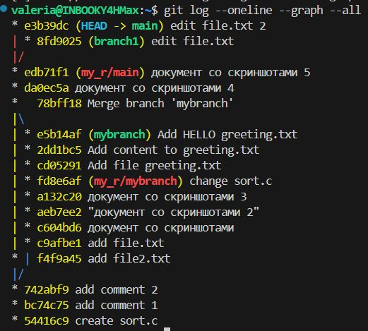

Оценка 5:
1.	Создать ветку branch1, переключиться на нее.
 
2.	Выполнить команду
 
3.	Закоммитить это изменение.
 
4.	Переключиться на главную ветку и выполнить команду.
echo "This is an indispensable truth!" > file.txt.
5.	Закоммитить изменения в master.
 
6.	Каков вывод git log --oneline --graph --all.
 
7.	Использовать команду git merge, чтобы смержить ветку branch1 в master (получим конфликт, это норм).
8.	Что показывает git status?
 
9.	Посмотреть содержимое файла file.txt и в любом любимом текстовом редакторе исправить конфликт. Желательно делать это в VSCode или любой другой умной среде, но если нет VSCode и не боитесь Vim и подобных редакторов, то можно через команду git mergetool.
 
10.	Что показывает git log --oneline --graph?
 
11.	Запушить изменения.
 
 
Починим Merge конфликты для сортировки MergeSort на Python. Содержимое base.py, lefty.py и righty.py находится в конце этого документа.
1.	Находясь в ветке master, создать файл mergesort.py с содержимым из base.py (см. приложение).
 
2.	Проиндексировать файл и закоммитить.
 
3.	Создать новую ветку Mergesort-Impl и переключиться на нее.
 
4.	Содержимое файла mergesort.py заменить на код из righty.py.
 
5.	Закоммитить изменения.
 
6.	Переключиться на master и изменить все содержимое mergesort.py на lefty.py.
 
 
7.	Закоммитить изменения.
 
8.	Что показывает git log --oneline --graph? так как мы находимся в main ветке, то отображаются коммит добавления mergesort.py и изменения его содержания на код из righty.py
 
9.	Что показывает git branch?
 
10.	Необходимо смержить Mergesort-Impl в master.
 
 
Различия состоят в том, что cтрочки left = m[:middle] и right = m[middle:] стоят в разном порядке, что не меняет сути и четвертая переменная называется разными именами, что также не меняет суть. complete merge
 
Сделаем коммит
 
11.	После исправления всех merge конфликтов запушить в master изменения.
12.	Запушить документ с результатами вашей работы

  

